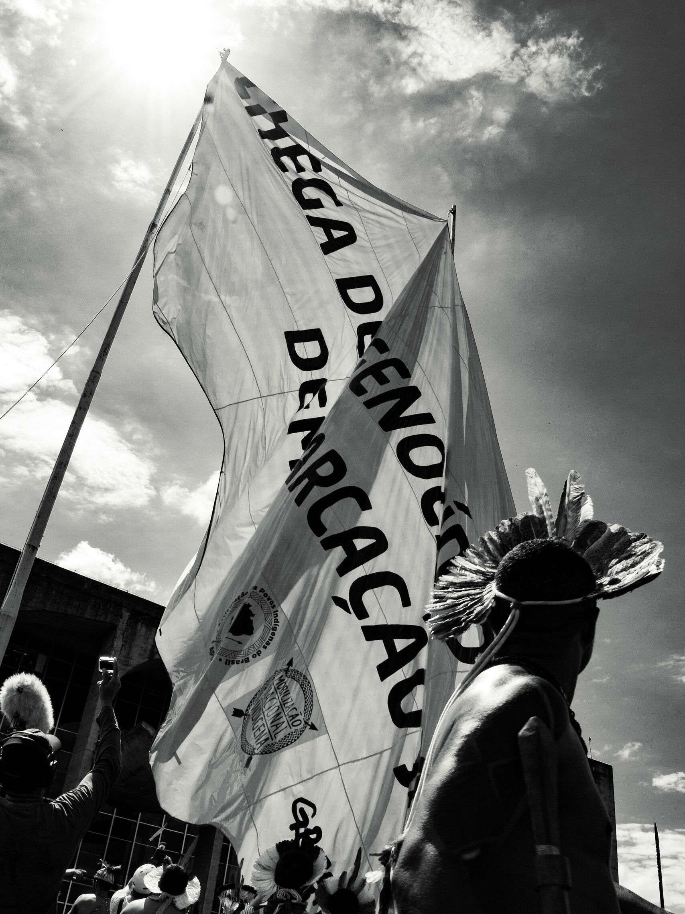
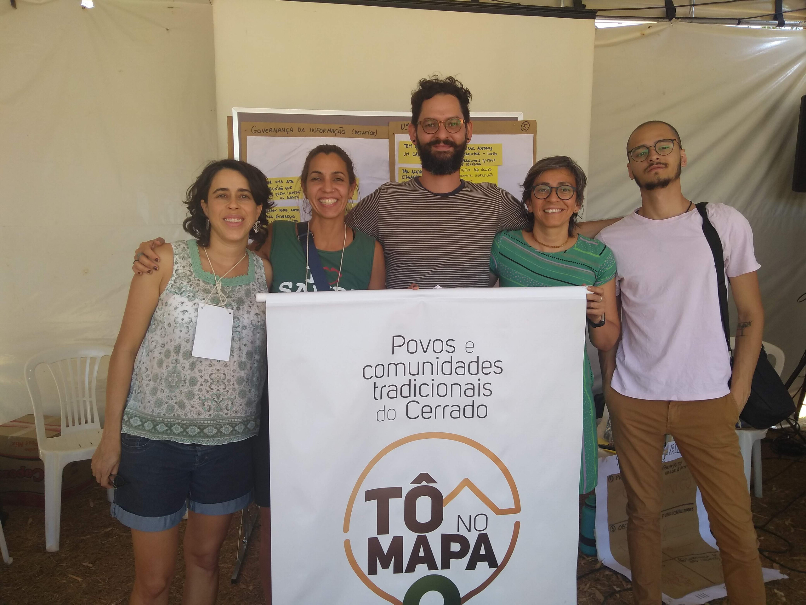
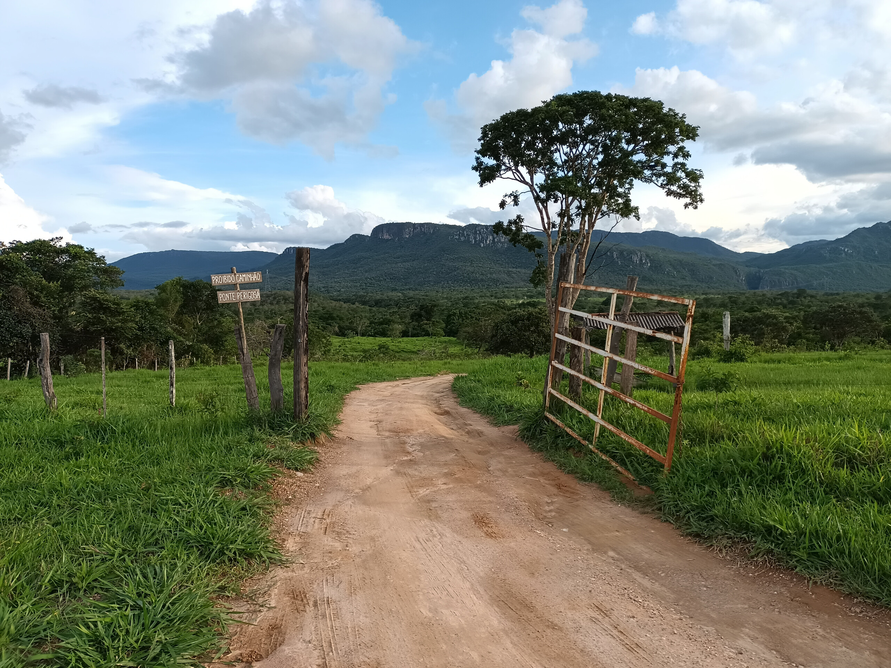
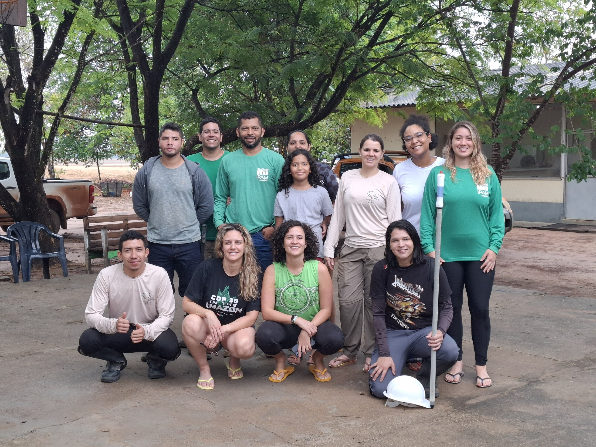
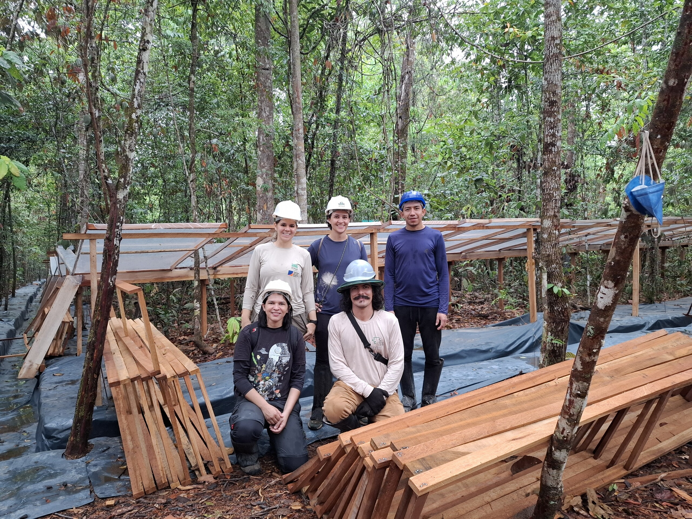
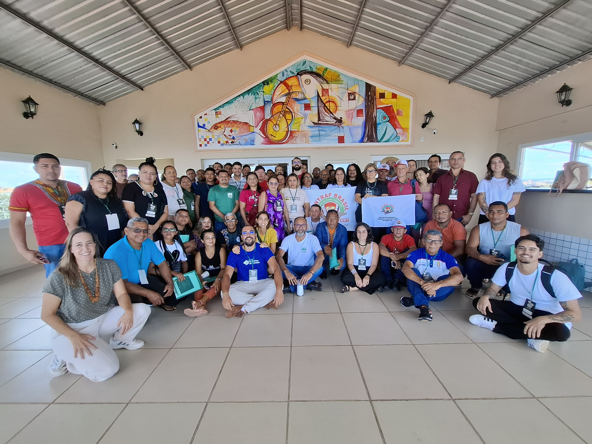
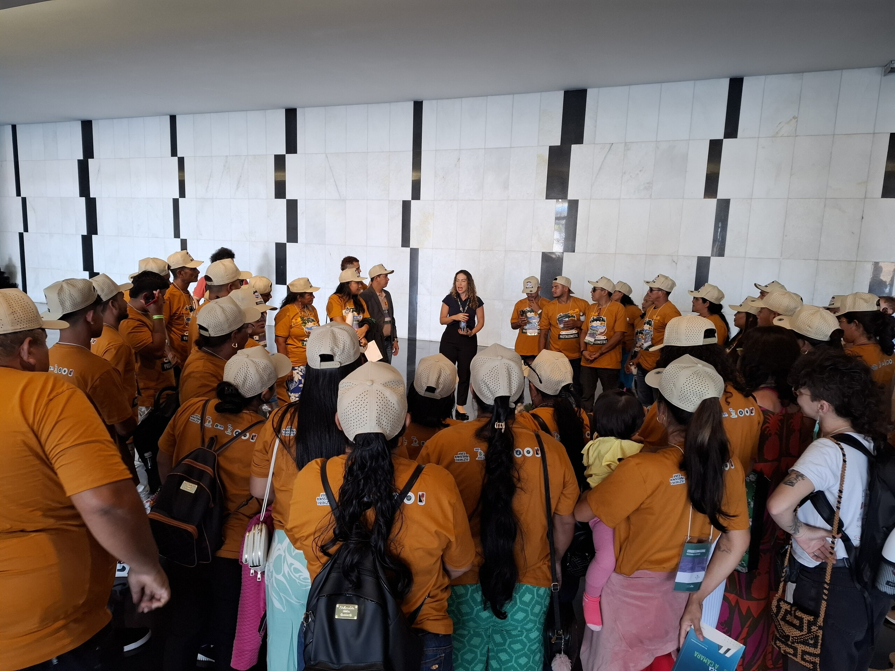
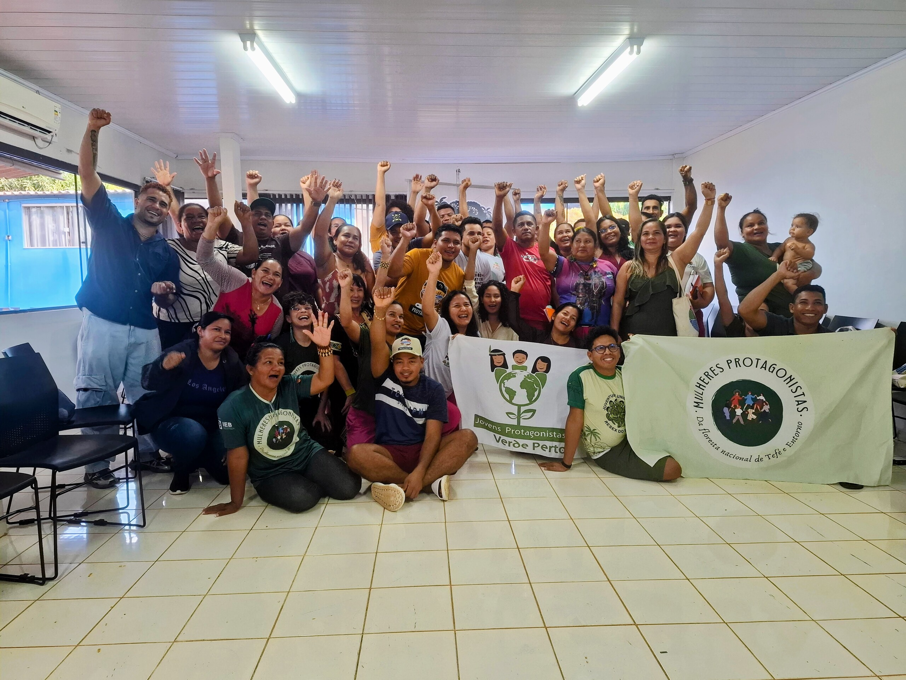
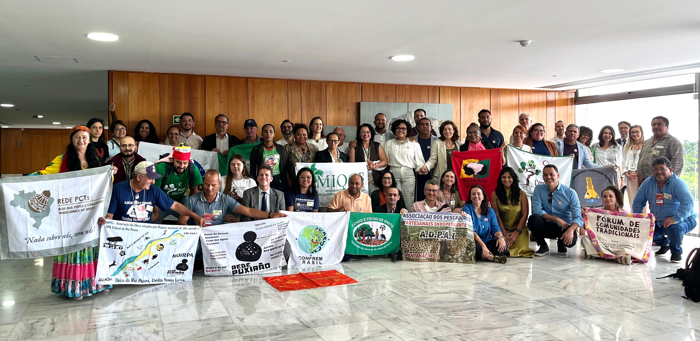

# 📋 Carlos Eduardo Rodrigues — Currículo / Resume

> **"Uso tecnologia open-source local de maneira engenhosa para unir antropologia, dados, ciência e comunicação."**

---

## 🌍 Sobre / About

Este repositório contém meu currículo em **3 versões** para diferentes públicos, cada uma em **Português (BR)** e **English (US)**.

This repository contains my resume in **3 versions** for different audiences, each in **English (US)** and **Português (BR)**.

Os projetos descritos aqui totalizam **~8M+ linhas e crescendo** (inclui código fonte, documentação e assets) — distribuídas em 1.227+ arquivos, construídos ao longo de 10 anos como projeto de vida.

The projects described here total **~8M+ lines and growing** (includes source code, documentation, and assets) — across 1,227+ files, built over 10 years as a life project.

---

## 📑 Versões / Versions

### 🇧🇷 Português

| # | Versão | Público | Arquivo |
|---|--------|---------|---------|
| 1 | **🖥️ Tech / Produto / Dados** | Startups, empresas de tecnologia, vagas em produto/dados/AI | [`pt-br/01-tech-produto-dados.md`](pt-br/01-tech-produto-dados.md) |
| 2 | **🌳 Socioambiental-Tech** | ONGs, institutos de pesquisa, organismos internacionais, projetos de impacto | [`pt-br/02-socioambiental-tech.md`](pt-br/02-socioambiental-tech.md) |
| 3 | **🚀 Sumænimá** | Aceleradoras, investidores, editais, parceiros | [`pt-br/03-sumaenima.md`](pt-br/03-sumaenima.md) |

### 🇺🇸 English

| # | Version | Audience | File |
|---|---------|----------|------|
| 1 | **🖥️ Tech / Product / Data** | Startups, tech companies, data/product/AI roles | [`en-us/01-tech-product-data.md`](en-us/01-tech-product-data.md) |
| 2 | **🌳 Socioenvironmental-Tech** | NGOs, research institutes, international organizations, impact projects | [`en-us/02-socioenvironmental-tech.md`](en-us/02-socioenvironmental-tech.md) |
| 3 | **🚀 Sumænimá** | Accelerators, investors, grants, partners | [`en-us/03-sumaenima.md`](en-us/03-sumaenima.md) |

---

## 🚀 Sumænimá — StênioBOT

**Plataforma de Captura de Dados com IA Local, Privada e Open-Source**
**~8M+ lines (includes source code, documentation, and assets) · 1.227+ files · 22 kernel modules · 132 check drivers · 30+ containers · 4 nodes · 10 yr project · ~2 active dev**

📱 **Responsive design** — iPhone SE · iPad Pro · Desktop

  
  
  

> *"O design de informação contemporâneo requer escuta ativa e pipelines estruturados. Unimos a etnografia antropológica e a engenharia de dados para criar sistemas de documentação fluidos, seguros e privados."*
>
> — Showcase Sumænimá

---

### 🎙️ StênioREC — Cockpit de Transcrição em Tempo Real
**Status:** 🟢 Em produção — funcional, validado em relatoria de campo

  

**Conceito:** Cockpit de ata em tempo real. Captura áudio via AudioWorklet API, transcreve com Whisper large-v3-turbo (CTranslate2 + cuBLAS) e purifica com Gemma 3 1B IT em pipeline paralelo — processamento de IA 100% local; transcrições sincronizadas via Google Docs com autenticação OAuth por usuário, em modo cooperativo.

**✨ Destaques:**
- 🧠 Pipeline Neural Flow dual-stage: Whisper draft sub-500ms + Gemma 3 purificação paralela
- 🔒 Buffer offline de ~2h (57MB RAM + 171MB IndexedDB), projetado para evitar perda de áudio sem rede
- 📝 Criação automática de Google Doc por usuário com credenciais próprias
- 🎛️ Cockpit em tempo real: GPU temp, VRAM, drift, entropia, status da rede
- 📱 Wake Lock API — gravação não suspende no celular
- ⚡ Descarrega VRAM automaticamente ao destravar contexto

**📋 Validação em Campo:**

- 🏛️ **CNPCT/Palácio do Planalto** — acompanhamento e relatoria das reuniões do Conselho Nacional dos Povos e Comunidades Tradicionais desde 2025, incluindo a 22ª Reunião Ordinária (mar/2026) com devolutiva do **Decreto de Regularização Fundiária** e fala de abertura da Ministra **Marina Silva**
- 🌱 **Semana da Sociobiodiversidade** (2025) — relatoria do **3º Encontro Nacional da Juventude das Populações Extrativistas e Tradicionais** (IEB/CNS/MCM/CONFREM) com **Stênio v1**
- 🏫 **FLONA de Tefé** (2025) — imersão de 39 lideranças no **Módulo II — "Formar Protagonistas"** (IEB/APAFE/Rainforest Trust)
- 📊 **IPEA** (jun/2026) — relatoria dos Movimentos 5 (Integração) e 7 (Gestão da Informação) no Encontro de Planejamento Estratégico do instituto, com StênioREC + observação etnográfica. Evento de 3 dias contratado via **Imagine Gestão Social**, resultando na agenda 2026–2027

**🎯 Para:** Relatoria etnográfica, entrevistas qualitativas, audiências públicas, atas corporativas.

---

### 🗂️ StênioPANEL — Scanner de Workshops
**Status:** 🔴 Concepção — arquitetura definida, código implementado, aguardando recursos

  

**Conceito:** Leitor de workshop físico. Transforma fotos de post-its, whiteboards e cartolinas em arquivos `.canvas` nativos do Obsidian — com visão computacional 100% local. Pipeline de 4 estágios: detecção zero-shot (GroundingDINO + SAM 2), OCR duplo com fallback automático, organizador por DBSCAN + arestas, e validador do spec oficial do Obsidian Canvas.

**✨ Destaques:**
- 🎯 Detecção zero-shot: não precisa de fine-tuning para nenhum evento
- 🔍 OCR duplo com fallback automático entre PaddleOCR (93.5%) e EasyOCR (89.2%)
- 🧩 Gera arquivos `.canvas` 100% compatíveis com Obsidian
- 📸 Processa fotos de até 50MP com algoritmo de tiling
- 🧠 Revisão semântica opcional com Gemma 3
- 🔄 VRAM Mutex: prioriza GPU com StênioREC; fila inteligente no Valkey se GPU ocupada
- 🗑️ Imagens destruídas após processamento — só metadados persistem

**🎯 Para:** Facilitadores de workshops, design thinking, agile coaches, etnógrafos.

---

### 🔍 StênioDIVE — Mineração Semântica
**Status:** 🔴 Concepção — arquitetura definida, motor de busca implementado, aguardando recursos

  

**Conceito:** Mineração semântica cruzada. Conecta transcrições do REC, boards do PANEL, notas do Obsidian e imagens em um único grafo interativo. Combina busca lexical BM25 com similaridade vetorial via embeddings ONNX 384-d (CPU, sem GPU), fusionados por Reciprocal Rank Fusion.

**✨ Destaques:**
- 🔎 Busca híbrida BM25 + cosseno vetorial com fusão RRF
- 📄 Indexa 4 fontes simultâneas: Google Docs, Canvas Boards, Obsidian, imagens
- 🧠 Embeddings ONNX 384-d 100% CPU, sem dependência de GPU
- ⚙️ Pipeline assíncrono com cache SHA-256 e cache OCR
- 🎛️ Filtros por fonte: transcrições, painéis, notas
- 🔗 Grafo interativo de wikilinks, tags e conexões semânticas

**🎯 Para:** Pesquisadores, analistas, gestores de conhecimento.

---

### 🌡️ DataVis — Visualizações Climáticas
**Status:** 🔴 Concepção — visualização PM2.5 instável; demais módulos em estágio inicial

  

**Conceito:** Dados climáticos como arte generativa. Partículas reagem a dados reais de qualidade do ar (PM2.5), vento e direção — transformando números em arte interativa. Cor das partículas reflete severidade (âmbar → vermelho fuligem), turbulência acompanha vento real, mouse cria campos de força no canvas.

**✨ Destaques:**
- 🎨 Canvas generativo com até 300 partículas reagindo a dados reais
- 🌬️ Vento e direção reais integrados: turbulência proporcional à velocidade
- 🖱️ Partículas interagem com o mouse (campo de força 120px)
- 🏥 Classificação OMS em 5 níveis com gauge dinâmico
- 🔄 Duas fontes de dados: WAQI e OpenAQ (alternável)
- ⚡ Cache adaptativo: 30s a 15min conforme popularidade
- 🧊 Arquitetura de microsserviço — roda no nó edge ybyra (Oracle, 1GB RAM)

**🎯 Para:** Pesquisadores ambientais, ativistas climáticos, data journalists, público geral.

---

### ⚙️ Admin — Gestão da Plataforma
**Status:** 🟡 Parcial — dashboard, auth e contatos OK; ERP básico; image library e CMS em desenvolvimento

  

**Conceito:** Painel central de administração. Métricas ao vivo, gestão de usuários, contatos, biblioteca de imagens e ERP completo (organizações, leads, contratos, faturas, projetos). Navegação em 5 abas com Material Design 3, glassmorfismo e compliance LGPD.

**✨ Destaques:**
- 📊 Dashboard com 7 métricas ao vivo: usuários, sessões WS, projetos, receita, caracteres, áudio, tokens
- 🗂️ ERP completo: organizações, Kanban de leads, contratos, faturas, projetos com board de tarefas
- 👤 Gestão de usuários com badge de admin protegido por env var (único owner)
- 🔒 Compliance LGPD: masking de email, IP em audit logs, banner de consentimento, versão de termos
- 📈 Umami Analytics embutido com CSP dinâmico
- 🖼️ Biblioteca de imagens e CMS com editor TipTap WYSIWYG
- 📬 CRUD de contatos com 3 estados: não lido, lido, arquivado
- 🛡️ Rota protegida — apenas o owner configurado por env var acessa o admin

**🎯 Para:** Administrador da plataforma, operador do sistema, gestor de negócio.

---

## 📊 Em Números / By the Numbers

| Métrica / Metric | Valor / Value |
|---|---|
| Linhas de código / Lines of code | **~8M+ e crescendo** |
| Arquivos / Files | 1.227+ |
| Projeto de vida / Life project | 10 anos / 10 years |
| Desenvolvimento ativo / Active development | ~2 anos / ~2 years |
| Módulos do Kernel / Kernel modules | 22 |
| Drivers de verificação / Check drivers | 132 |
| Containers em produção / Production containers | 30+ |

---

## 📖 Narrativa / Narrative

### 🧵 O Fio da Meada

Minha carreira parece não linear até que você percebe o padrão: **ao longo da minha carreira, usei tecnologia para aproximar mundos**.

Comecei como estagiário no [**ISPN**](https://ispn.org.br/) (2017), onde fiz pesquisa etnográfica com comunidades tradicionais do Cerrado — dados oficiais representavam apenas 28% dessas comunidades; a lacuna as tornava invisíveis para políticas públicas. O que eu aprendi em campo — que dados não são só números, mas territórios, memórias e lutas — me levou a co-criar a [**Plataforma Tô no Mapa**](https://tonomapa.org.br/), hoje integrada ao Ministério Público Federal.

No [**IPAM**](https://ipam.org.br/pt/) (2022–2025), passei de estagiário a analista, liderei a estratégia digital que gerou **+143% de crescimento orgânico e pago** (+143,3% Facebook, +100% Instagram, 66,7K interações, alcance de **2+ milhões**), implementei Agile/Scrum como Scrum Master, codirigi um documentário pelo IPAM sobre mudanças climáticas e ganhei um prêmio Mercosul de jornalismo científico. Mas também descobri o que **não** queria: comunicação institucional para terceiros. O burnout veio junto com a clareza.

Em 2024, comecei a construir o **StênioBOT** — a plataforma de captura de dados com IA local da [**Sumænimá**](https://sumaenima.chimaera-heptatonic.ts.net), meu projeto de vida que já existia como entidade criativa independente desde 2016. Juntei tudo que aprendi: antropologia, dados, tecnologia. Dados sensíveis de comunidades não deveriam depender de big tech. Essa é a tese.

Desde 2025, acompanho como relator as reuniões do **CNPCT** (Conselho Nacional dos Povos e Comunidades Tradicionais). Em março de 2026, o **StênioREC** esteve no **Palácio do Planalto** capturando em tempo real a devolutiva do **Decreto de Regularização Fundiária** na 22ª Reunião Ordinária do CNPCT — validação em instância máxima de governo, com a fala de abertura da Ministra **Marina Silva**.

Em paralelo, construí o **Homelab Mnemocine**: 4 servidores (incluindo um Dell Frankenstein com Arch Linux (I Use Arch BTW) e RTX 5050 e um notebook velho reaproveitado), orquestrados em Docker Swarm com Tailscale, porque acredito que tecnologia útil não se descarta — e que é possível fazer IA de ponta com dependência mínima de nuvem.

Em paralelo, escrevi para o **JOTA** o artigo *"Doenças são sintomas de uma crise cultural e ambiental"*, sobre a relação entre crise climática e saúde pública pela perspectiva dos Povos e Comunidades Tradicionais.

Em paralelo, construí o **Homelab Mnemocine**: 4 servidores (incluindo um Dell Frankenstein com Arch Linux (I Use Arch BTW) e RTX 5050 e um notebook velho reaproveitado), orquestrados em Docker Swarm com Tailscale, porque acredito que tecnologia útil não se descarta — e que é possível fazer IA de ponta com dependência mínima de nuvem.

Mas o trabalho mais profundo é invisível: o **StênioKernel** — um Kernel proprietário de Governança para Agentes de IA (21.435 linhas, 132 drivers, 10 camadas anti-bypass) que governa todos os agentes de IA trabalhando na Sumænimá. Ele aplica criptograficamente regras de governança, tenta corrigir violações automaticamente com rollback e é projetado para impedir que agentes burlem a governança. É o sistema operacional que torna a IA confiável, auditável e responsável.

Hoje sou um **híbrido**: arquiteto de dados e produtos com alma de antropólogo. Sei traduzir necessidades de pesquisa em requisitos de sistema, e arquitetura técnica em impacto socioambiental.

---

### 🧵 The Thread

My career looks nonlinear until you see the pattern: **Throughout my career, I've used technology to bridge worlds**.

I started as an intern at [**ISPN**](https://ispn.org.br/) (2017), doing ethnographic research with traditional Cerrado communities — official data represented only 28% of these communities; the gap rendered them invisible to public policy. What I learned in the field — that data isn't just numbers, but territories, memories, and struggles — led me to co-create the [**Tô no Mapa Platform**](https://tonomapa.org.br/), now integrated with Brazil's Federal Public Ministry.

At [**IPAM**](https://ipam.org.br/pt/) (2022–2025), I went from intern to analyst, led the digital strategy that drove **+143% organic and paid growth** (+143.3% Facebook, +100% Instagram, 66.7K interactions, **2+ million** reach), implemented Agile/Scrum as Scrum Master, co-directed a climate change documentary for IPAM, and won a Mercosur science journalism award. I also discovered what I **didn't** want: institutional communication for others. Burnout came with clarity.

The turning point came in 2024, when I started building **StênioBOT** — the local-AI data capture platform under [**Sumænimá**](https://sumaenima.chimaera-heptatonic.ts.net), my life project that had already existed as an independent creative entity since 2016. I brought everything together: anthropology, data, technology. Sensitive community data shouldn't depend on big tech. That's the thesis.

Since 2025, I have been following and reporting on the **CNPCT** (National Council of Traditional Peoples and Communities) meetings. In March 2026, **StênioREC** was at the **Palácio do Planalto** capturing in real time the **Land Regularization Decree** hearing at the 22nd Ordinary Meeting of the **CNPCT** — validation at the highest level of government, including the opening speech by Minister **Marina Silva**.

I also wrote for **JOTA** the article *"Doenças são sintomas de uma crise cultural e ambiental"*, on the link between climate crisis and public health through the lens of Traditional Peoples and Communities.

In parallel, I built the **Mnemocine Homelab**: 4 servers (including a Dell Frankenstein running Arch Linux (I Use Arch BTW) with an RTX 5050 and a repurposed old laptop), orchestrated with Docker Swarm and Tailscale — because useful technology shouldn't be discarded, and because cutting-edge AI can work with minimal cloud dependency.

But my deepest work is invisible: the **StênioKernel** — a proprietary AI Agent Governance Kernel (21.435 lines, 132 check drivers, 10 anti-bypass layers) that governs every AI agent working on Sumænimá. It cryptographically enforces governance rules, attempts automated violation repair with rollback, and is designed to prevent agents from bypassing governance. It is the operating system that makes AI reliable, auditable, and accountable.

Today I'm a **hybrid**: data and product architect with an anthropologist's soul. I translate research needs into system requirements, and technical architecture into socio-environmental impact.

---

## 📸 Registros / Field Photos

| | |
|:-:|:-:|
|  |  |
| **2017** · Sertão MG — Comunidade Quilombola | **2017** · ISPN MA-TO — Maranhão |
|  |  |
| **2018** · Acampamento Terra Livre — Brasília | **2019** · Oficina Tô no Mapa — UFT |
|  |  |
| **2019** · Encontro dos Povos do Cerrado | **2021** · Porteira da Fazenda Canadá — Chapada dos Veadeiros |
|  |  |
| **2024** · Visita Estação Tanguro — IPAM, MT | **2024** · Experimento Seca Limite — Fazenda Tanguro |
|  |  |
| **2025** · Oficina Florestas Públicas — IPAM, Santarém | **2025** · Formar Protagonistas — FLONA no Congresso Nacional |
|  |  |
| **2025** · Formar Protagonistas — FLONA de Tefé (grupo) | **2026** · CNPCT — Palácio do Planalto |

---

## 🔍 cvcheck — Miniatura do StênioKernel

Este repositório inclui o **cvcheck**, uma versão reduzida e portátil do StênioKernel que valida e governa este currículo com checks automatizados, verificação de imutabilidade, auto-auditoria, tendências históricas e um sistema de registro de reparos (permanent/negative registry). Uma demonstração funcional dos mesmos princípios que o StênioKernel aplica em escala no ecossistema Sumænimá.

---

## 📜 License

- **Code** (cvcheck, scripts, tooling): [MIT](LICENSE.md)
- **Content** (CVs, README, documentation): [CC-BY-4.0](https://creativecommons.org/licenses/by/4.0/)

---

## 📬 Contato / Contact

- 📧 **Email:** [ceduardorodrig@gmail.com](mailto:ceduardorodrig@gmail.com)
- 📱 **Phone / WhatsApp:** +55 (61) 9-9803-3546
- 💼 **LinkedIn:** [linkedin.com/in/c-eduardo-rodrigues](https://linkedin.com/in/c-eduardo-rodrigues)
- 🐙 **GitHub:** [github.com/ceduardorodrig](https://github.com/ceduardorodrig)
- 🌐 **Sumænimá:** [sumaenima.chimaera-heptatonic.ts.net](https://sumaenima.chimaera-heptatonic.ts.net)
- 📍 **Location:** Brasília-DF, Brazil

---

🕐 *Última atualização / Last updated: junho 2026*
